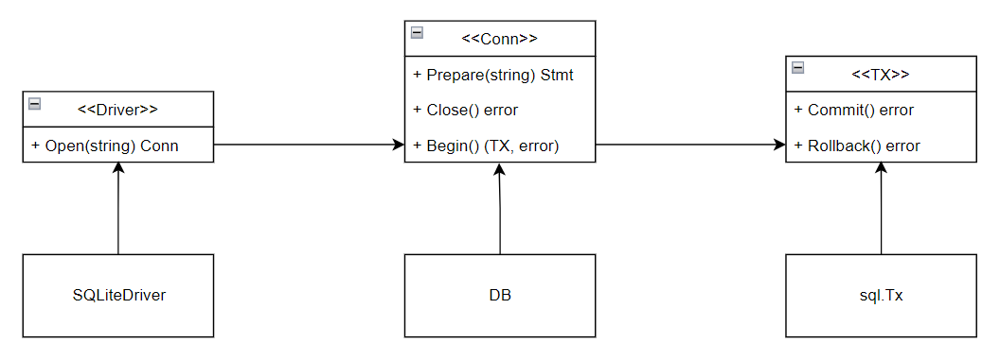

# Notice

- Go haven't define the driver of database, instead Go design the interface of driver, driver only can implement the interface of driver. The database can register the driver to Go with package `_ "github.com/mattn/go-sqlite3"` by init function:
```
// sqlite3.go

func init() {
	if driverName != "" {
		sql.Register(driverName, &SQLiteDriver{})
	}
}
```


- The database can implement the interface of driver as:  



- The driver is not the entity of database, the entity of database like server should be deployed previous, then can access to the entity by register the driver of database. Othwise, it will report error like can not access to database.  


- SQL Injection is a database loophole, it can prevent from database framework with `=?` structure, the structure will make frame to parse the SQL instruction and then parse the paramenter of the value of `?`. More detail about SQL Injection can refer to [SQL Injection](http://c.biancheng.net/view/8283.html)


- List the Pos and Pas of SQL and NOSQL:
```
Pos:
	SQL:
		- unify table structure.
		- unify SQL lanaguage to do the CRUD of data.
		- high capacity of data which store the data in disk. 
	NOSQL:
		- save object with different property.
		- flexible to store the data, can store in memory and disk both.
		- so fast to handle mass data with CRUD operation.
		- support concurrency, high availablity and so on.
Pas:
	SQL:
		- waste space if the field is not needed, but it should be used cause the unity of table.
		- so hard to operate the mass data in table.
		- low efficiency for RW cause the data stored in disk.
	NOSQL:
		- No transaction handle, is not safe to operate data(with concurrency mode?).
		- Not safe to restore data if the data store in memory.
```

More detail info can refer to [database introduction](http://c.biancheng.net/view/7122.html) and [sql tutorial](http://go-database-sql.org/index.html)


- With ORM is to add new layer with Go style to operate the structure object to database, list the Pos and Pas as:
```
Pos:
	- Easy to use for user, only need operate the ORM with Go style instead of know the SQL directly.
	- The new layer will loose coupling between user and database.
Pas:
	- Does the loose coupling is really needed or whether is add more time complexity, need evaluate with the requirement of project.
```
