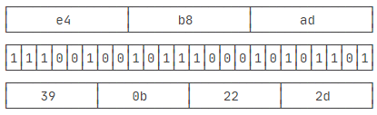
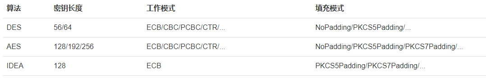

# 1. encrypt

## 1.1 base64
The base64 is not an encryption algorithm, is an encoding algorithm, the example as:  

With the base64 encoding the length of data will increase 1/3。
The base64 can trans the binary file to text so that the binary file can be treated as a text.

## 1.2 symmetric encryption
The symmtric encryption has several types as:  

The aes is the popular and safe one.

For aes use CBC can make the cipher text different with the random iv.

# 2. Reference
- [编码算法](https://www.liaoxuefeng.com/wiki/1252599548343744/1304227703947297)
- [对称加密算法](https://www.liaoxuefeng.com/wiki/1252599548343744/1304227762667553)
