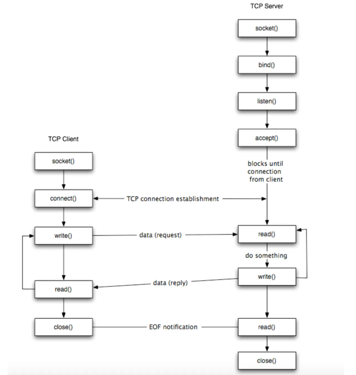

# 0. socket 介绍
Liunx 中一切皆文件。通过文件描述符和系统调用号可以实现对任何设备的访问。同样的，socket 也是一种文件描述符。通过 socket 可以建立网络传输。对于 TCP 和 UDP 来说，其底层都是基于 socket 进行网络通信。
本文通过代码示例介绍 socket 以加深对 socket 的理解。

# 1. 代码示例
从代码入手逐层分析 socket 实现。server 端代码如下：
```
addr := "default-route-openshift-image-registry.apps.xxx.net:6445"
tcpAddr, err := net.ResolveTCPAddr("tcp4", addr)
if err != nil {
    fmt.Println(err)
}

listener, err := net.ListenTCP("tcp4", tcpAddr)
result := make(chan error)
go handleResult(result)

for {
    conn, err := listener.Accept()
    if err != nil {
        fmt.Println(err)
    }

    go handleClient(conn, result)
}
```

注：handleClient 代码可参考 [server.go](https://github.com/hxia043/go-by-example/blob/main/socket/server/server.go)

上述 server 端代码有几点要注意的是：
- 可使用 for + goroutine 的方式实现并发。
- server 端可使用 net.Conn 的 SetReadDeadline 实现读数据的长连接，更多内容可参考 net 包。
- server 端不应报错，而应将错误结果传给 client，由 client 处理。
- 读取网络数据需要指定读取字节大小，防止 flood attack。
- 如果子 goroutine 调用 os.Exit() 主程序也会退出。


client 端代码如下：
```
tcpConn, err := net.DialTCP("tcp4", nil, tcpAddr)
defer tcpConn.Close()

if err != nil {
    fmt.Println(err)
}

for {
    if _, err = tcpConn.Write([]byte("hello, server")); err != nil {
        fmt.Println("Error: ", err)
        break
    }

    reply := make([]byte, 256)
    _, err := tcpConn.Read(reply)
    if err != nil {
        fmt.Println("Error: ", err)
        break
    }

    time.Sleep(30 * time.Second)
}
```

从代码可以看出：
- 长连接仅当 client 或 server 有一方关闭连接时，连接才关闭。对于上述 client 端代码会循环写数据到 socket，直到 server 端读取超时，关闭长连接。

# 2. socket 实现
下面重点介绍实现 socket 网络传输的 `Listen`,`Accept`,`Read` and `Write` 方法。socket 结构图如下：  



## 2.1 Listen
示例中调用 net 包的 ListenTCP 函数实现 socket 的监听：
```
listener, err := net.ListenTCP("tcp4", tcpAddr)

type TCPListener struct {
	fd *netFD
	lc ListenConfig
}
```

ListenTCP 返回一个 TCPListener 类型对象 `listener`，该对象实现 Listener 接口：
```
// src/net/net.go

type Listener interface {
	// Accept waits for and returns the next connection to the listener.
	Accept() (Conn, error)

	// Close closes the listener.
	// Any blocked Accept operations will be unblocked and return errors.
	Close() error

	// Addr returns the listener's network address.
	Addr() Addr
}
```

其包括一个网络文件描述符 netFD 和配置 ListenConfig：
```
type netFD struct {
	pfd poll.FD

	// immutable until Close
	family      int
	sotype      int
	isConnected bool // handshake completed or use of association with peer
	net         string
	laddr       Addr
	raddr       Addr
}

type ListenConfig struct {
	Control func(network, address string, c syscall.RawConn) error
	KeepAlive time.Duration
}
```

顺着 ListenTCP 往下走，部分代码做简化处理：
```
func ListenTCP(network string, laddr *TCPAddr) (*TCPListener, error) {
	sl := &sysListener{network: network, address: laddr.String()}
	ln, err := sl.listenTCP(context.Background(), laddr)
	if err != nil {
		return nil, &OpError{Op: "listen", Net: network, Source: nil, Addr: laddr.opAddr(), Err: err}
	}
	return ln, nil
}

func (sl *sysListener) listenTCP(ctx context.Context, laddr *TCPAddr) (*TCPListener, error) {
	fd, err := internetSocket(ctx, sl.network, laddr, nil, syscall.SOCK_STREAM, 0, "listen", sl.ListenConfig.Control)
	if err != nil {
		return nil, err
	}
	return &TCPListener{fd: fd, lc: sl.ListenConfig}, nil
}

func internetSocket(ctx context.Context, net string, laddr, raddr sockaddr, sotype, proto int, mode string, ctrlFn func(string, string, syscall.RawConn) error) (fd *netFD, err error) {
	return socket(ctx, net, family, sotype, proto, ipv6only, laddr, raddr, ctrlFn)
}
```

`internetSocket` 的传参 syscall.SOCK_STREAM 是流式 socket 的系统调用号，对应的是 TCP 协议。另一种 syscall.SOCK_DGRAM 是数据报式 socket，对应的是 UDP 协议。  

`socket` 函数返回的是网络文件描述符 netFD：
```
type netFD struct {
	pfd poll.FD

	// immutable until Close
	family      int
	sotype      int
	isConnected bool // handshake completed or use of association with peer
	net         string
	laddr       Addr
	raddr       Addr
}
```

`socket` 函数是这里介绍的重点：
```
func socket(ctx context.Context, net string, family, sotype, proto int, ipv6only bool, laddr, raddr sockaddr, ctrlFn func(string, string, syscall.RawConn) error) (fd *netFD, err error) {
	s, err := sysSocket(family, sotype, proto)
	if err != nil {
		return nil, err
	}

	if fd, err = newFD(s, family, sotype, net); err != nil {
		poll.CloseFunc(s)
		return nil, err
	}
}
```

它做了两块事情，第一通过 sysSocket 执行系统调用返回 socket 的文件描述符 id。第二通过 netFD 返回文件描述符结构。

首先看 sysSocket 逻辑：
```
func sysSocket(family, sotype, proto int) (int, error) {
	s, err := socketFunc(family, sotype|syscall.SOCK_NONBLOCK|syscall.SOCK_CLOEXEC, proto)
	...
	return s, nil
}

// go/src/syscall/syscall_unix.go
func Socket(domain, typ, proto int) (fd int, err error) {
	fd, err = socket(domain, typ, proto)
	return
}

func socket(domain int, typ int, proto int) (fd int, err error) {
	r0, _, e1 := RawSyscall(SYS_SOCKET, uintptr(domain), uintptr(typ), uintptr(proto))
	fd = int(r0)
	if e1 != 0 {
		err = errnoErr(e1)
	}
	return
}

func RawSyscall(trap, a1, a2, a3 uintptr) (r1, r2 uintptr, err Errno) {
	return RawSyscall6(trap, a1, a2, a3, 0, 0, 0)
}

// go/src/syscall/asm_plan9_amd64.s
TEXT	·RawSyscall6(SB),NOSPLIT,$0-80
	MOVQ	trap+0(FP), BP	// syscall entry
	// slide args down on top of system call number
	LEAQ	a1+8(FP), SI
	LEAQ	trap+0(FP), DI
	CLD
	MOVSQ
	MOVSQ
	MOVSQ
	MOVSQ
	MOVSQ
	MOVSQ
	SYSCALL
	MOVQ	AX, r1+56(FP)
	MOVQ	AX, r2+64(FP)
	MOVQ	AX, err+72(FP)
	RET
```

可以看到，通过层层调用到汇编，根据系统调用号 SYS_SCOKET 执行系统调用，返回 socket 的文件描述符 fd。

接着通过 netFD 包含该文件描述符生成网络文件描述符对象：
```
func newFD(sysfd, family, sotype int, net string) (*netFD, error) {
	ret := &netFD{
		pfd: poll.FD{
			Sysfd:         sysfd,
			IsStream:      sotype == syscall.SOCK_STREAM,
			ZeroReadIsEOF: sotype != syscall.SOCK_DGRAM && sotype != syscall.SOCK_RAW,
		},
		family: family,
		sotype: sotype,
		net:    net,
	}
	return ret, nil
}
```

生成网络文件描述符后，`socket` 继续执行：
```
func socket(ctx context.Context, net string, family, sotype, proto int, ipv6only bool, laddr, raddr sockaddr, ctrlFn func(string, string, syscall.RawConn) error) (fd *netFD, err error) {
	...
	if laddr != nil && raddr == nil {
		switch sotype {
		case syscall.SOCK_STREAM, syscall.SOCK_SEQPACKET:
			if err := fd.listenStream(laddr, listenerBacklog(), ctrlFn); err != nil {
				fd.Close()
				return nil, err
			}
			return fd, nil
		case syscall.SOCK_DGRAM:
			if err := fd.listenDatagram(laddr, ctrlFn); err != nil {
				fd.Close()
				return nil, err
			}
			return fd, nil
		}
	}
	if err := fd.dial(ctx, laddr, raddr, ctrlFn); err != nil {
		fd.Close()
		return nil, err
	}
	return fd, nil
}
```

根据 laddr 和 raddr 判断执行 socket 的行为，如果是 laddr 有值而 raddr 无值，则判断当前行为为 listen。通过判断 socket 类型确定 listen 的是 TCP 还是 UDP socket。以 TCP socket 为例，走到 `listenStream` 方法：
```
func (fd *netFD) listenStream(laddr sockaddr, backlog int, ctrlFn func(string, string, syscall.RawConn) error) error {
	...
	if err = syscall.Bind(fd.pfd.Sysfd, lsa); err != nil {
		return os.NewSyscallError("bind", err)
	}
	if err = listenFunc(fd.pfd.Sysfd, backlog); err != nil {
		return os.NewSyscallError("listen", err)
	}
}
```

首先调用 Bind 方法执行系统调用绑定本地 addr 到 socket：
```
func bind(s int, addr unsafe.Pointer, addrlen _Socklen) (err error) {
	_, _, e1 := Syscall(SYS_BIND, uintptr(s), uintptr(addr), uintptr(addrlen))
	if e1 != 0 {
		err = errnoErr(e1)
	}
	return
}

func Syscall(trap, a1, a2, a3 uintptr) (r1, r2 uintptr, err Errno) {
	runtime_entersyscall()
	r1, r2, err = RawSyscall6(trap, a1, a2, a3, 0, 0, 0)
	runtime_exitsyscall()
	return
}
```

这里的参数要稍加介绍下，第一个参数为系统调用号，第二个是 socket 文件描述符，第三个是绑定到 socket 上的 addr，第四个是 addr 的长度。对于 socket bind 系统调用来说，这些信息都是需要的。

socket 绑定后继续执行就需要 Listen socket，类似地执行 SYS_LISTEN 系统调用：
``` 
func Listen(s int, n int) (err error) {
	_, _, e1 := Syscall(SYS_LISTEN, uintptr(s), uintptr(n), 0)
	if e1 != 0 {
		err = errnoErr(e1)
	}
	return
}
```

通过以上分析可以看出，通过层层调用系统调用实现 socket 的创建，绑定和监听。
