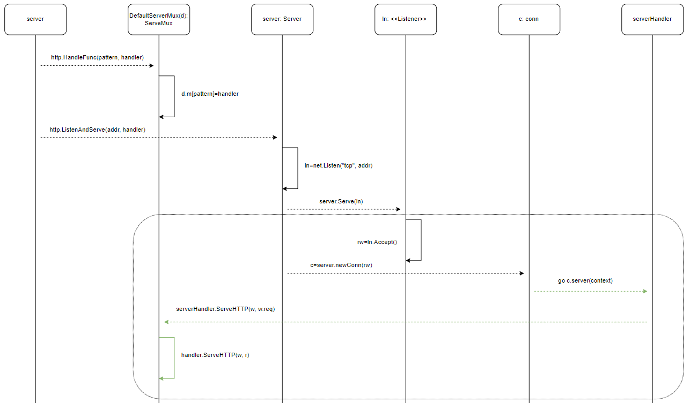

# 0. Web Introduction

Let's check the function of `HandleFunc` and `ListenAndServe` to see what happened during the web request handle.
```
http.HandleFunc("/", sayhelloName)
http.ListenAndServe(":9091", nil)
```

The web procedure as below:  


# 1. HandleFunc
The default server multiplexer `DefaultServeMux` will be used to add the pattern and handler into the map `m` of DefaultServeMux in the `HandleFunc` function:
```
type ServeMux struct {
	mu    sync.RWMutex
	m     map[string]muxEntry
	es    []muxEntry 			// slice of entries sorted from longest to shortest.
	hosts bool       			// whether any patterns contain hostnames
}

func HandleFunc(pattern string, handler func(ResponseWriter, *Request)) {
	DefaultServeMux.HandleFunc(pattern, handler)
}
```

With the `HandleFunc` method of `DefaultServeMux`, the function `handler` has translate to `HandleFunc` to implement the interface of Handler:
``` 
func (mux *ServeMux) HandleFunc(pattern string, handler func(ResponseWriter, *Request)) {
	mux.Handle(pattern, HandlerFunc(handler))
}

func (mux *ServeMux) Handle(pattern string, handler Handler) {
    ...
	if mux.m == nil {
		mux.m = make(map[string]muxEntry)
	}
	e := muxEntry{h: handler, pattern: pattern}
	mux.m[pattern] = e
}
```

In the `Handle` method, the default serve multiplexer has add the key and value into map `m`.  

Then the query is coming, how to use the map `m`? Let's continue see the function of `ListenAndServe` with the query:

# 2. ListenAndServe
First, create an object server to run the `ListenAndServe` method:
```
func ListenAndServe(addr string, handler Handler) error {
	server := &Server{Addr: addr, Handler: handler}
	return server.ListenAndServe()
}
```

There are two actions `net.Listen` and `srv.Serve` in the `ListenAndServe` method:
```
func (srv *Server) ListenAndServe() error {
	...
	ln, err := net.Listen("tcp", addr)
	return srv.Serve(ln)
}
```

Continue check the `net.Listen` function. The function will listen to the address based on tcp protocol, and then return the listener `ln` for `srv.Serve`.

Then in the `Serve` method, combine the `for` range and goroutine `go c.serve(connCtx)` can provide the concurrency of web service: 
```
func (srv *Server) Serve(l net.Listener) error {
	baseCtx := context.Background()
	ctx := context.WithValue(baseCtx, ServerContextKey, srv)

	for {
		rw, err := l.Accept()
		connCtx := ctx
		c := srv.newConn(rw)
		go c.serve(connCtx)
	}
	...
}
```

The listener will choke on `Accept` method to waiting the connection from client.    
Once connect request received, the `Accept` will return the `net.Conn` object `rw`.  
The object has include the request info of this connection.

Next call the `serve` method to serve the new connection:
```
func (c *conn) serve(ctx context.Context) {
	ctx, cancelCtx := context.WithCancel(ctx)
	c.cancelCtx = cancelCtx
	defer cancelCtx()

	for {
		w, err := c.readRequest(ctx)
		serverHandler{c.server}.ServeHTTP(w, w.req)
		w.cancelCtx()
	}
}
```

In the `serve` method, the `response` object `w` has been read from `context.Context` ctx by `readRequest` of `c`, the `w` is the parameter of `ServeHTTP`. 
`serverHandler` is the serve handler which to handle the serve by `ServeHTTP` as:
```
func (sh serverHandler) ServeHTTP(rw ResponseWriter, req *Request) {
	handler := sh.srv.Handler
	if handler == nil {
		handler = DefaultServeMux
	}

	handler.ServeHTTP(rw, req)
}
```

The handler of `sh.srv.Handler` is the parameter of function `http.ListenAndServe(addr string, handler Handler)`, here is `nil`. So the handler has be assign to `DefaultServeMux`.  

The `DefaultServeMux` as a `ServeMux` has implemented the `ServeHTTP` method of interface `Handler`:
```
type Handler interface {
	ServeHTTP(ResponseWriter, *Request)
}

func (mux *ServeMux) ServeHTTP(w ResponseWriter, r *Request) {
	h, _ := mux.Handler(r)
	h.ServeHTTP(w, r)
}
```

`mux.Handler` will read the map `mux.m` with pattern that get from `r` and return the handler, the handler `h` will call the `ServeHTTP` method to handle the request and send response to client.

The `handler` as a `HandlerFunc` has implement the interface of Handler by translate the function handler to `HandlerFunc` previously:
```
// HandleFunc registers the handler function for the given pattern.
func (mux *ServeMux) HandleFunc(pattern string, handler func(ResponseWriter, *Request)) {
	mux.Handle(pattern, HandlerFunc(handler))
}

// ServeHTTP calls f(w, r).
func (f HandlerFunc) ServeHTTP(w ResponseWriter, r *Request) {
	f(w, r)
}
```

# 3. Structure
Based on the analysis, we can get the network service procedure as:  


And the web handle procedure as:  


The diagram is from [build-web-application-with-golang](https://github.com/astaxie/build-web-application-with-golang/blob/master/zh/03.3.md), more detailed info can refer to there.

# 4. Reference
- [context](https://www.cnblogs.com/xingzheanan/p/15692269.html) has introduce the context.
- [net package](https://www.cnblogs.com/xingzheanan/p/14691736.html) and [http package](https://www.cnblogs.com/xingzheanan/p/15649033.html) has introduce the net and http package which support the web service.
